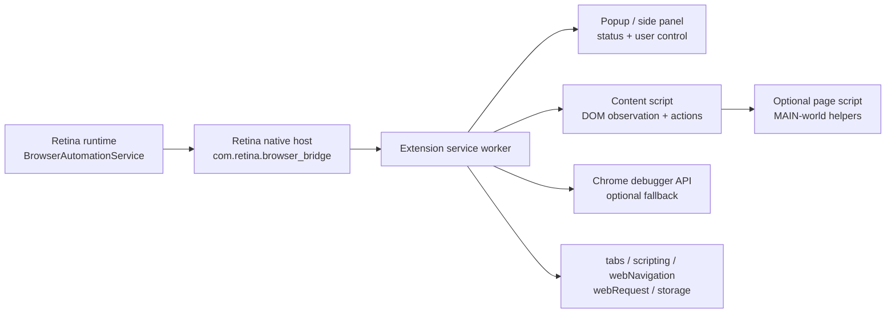

# Retina Browser Extension Bridge Plan

Date: 2026-05-21

This plan describes the standalone browser extension project Retina should build
to replace the private Claude Chrome extension while keeping Retina's current
source-shaped browser automation contracts intact.

The future extension project can copy this document as its implementation brief.
Retina remains the reference runtime and contract owner.

## Current Retina Contract To Preserve

retina project we are building extension for.
`/Users/macc/projects/personal/retina/`

Retina already has the browser lane shaped around the source Chrome MCP tools.
The extension must speak this contract first, then add implementation behind it.

- Runtime bridge kind: `retina-browser-bridge`
- Compatibility protocol: `source_chrome_mcp_compatibility`
- Compatibility server name: `claude-in-chrome`
- Native host id: `com.retina.browser_bridge`
- Native host manifest: `com.retina.browser_bridge.json`
- Tool request envelope:

```json
{
  "type": "tool_request",
  "method": "computer",
  "params": {},
  "requestId": "request-id",
  "compatibilityServerName": "claude-in-chrome",
  "bridgeKind": "retina-browser-bridge",
  "protocol": "source_chrome_mcp_compatibility"
}
```

- Tool response envelope:

```json
{
  "type": "tool_response",
  "requestId": "request-id",
  "method": "computer",
  "isError": false,
  "content": [
    { "type": "text", "text": "..." }
  ],
  "structuredContent": {}
}
```

Retina currently gates dispatch through capabilities and source tool contracts in
`rust_source/src/services/browser.rs`. The first deployable extension must cover:

- `tabs_context_mcp`
- `tabs_create_mcp`
- `read_page`
- `get_page_text`
- `find`
- `computer`
- `navigate`
- `read_console_messages`
- `read_network_requests`
- site permission gating
- visible user control

The following source-compatible tools can follow after the first useful bridge:

- `form_input`
- `resize_window`
- `javascript_tool`
- `upload_image`
- `gif_creator`
- `shortcuts_list`
- `shortcuts_execute`
- `update_plan`

## Research Summary

Use these projects as examples and pattern references. Copy code only after a
license review and attribution pass.

| Project | Useful Pattern | Notes |
| --- | --- | --- |
| Google Chrome extension samples | MV3 structure, service workers, native messaging examples, extension API examples | Apache-2.0. Best starting point for browser API mechanics. |
| Chrome native messaging docs | Native host connection, 32-bit length-prefixed JSON framing, manifest registration, debugging failures | This matches the native-host framing already ported in Retina. |
| Chrome message passing docs | Long-lived ports between service worker, extension pages, content scripts, and native host | Needed for per-tab state and stable request routing. |
| Chrome content scripts docs | Isolated-world model and content-script/page-script boundary | Important for safe DOM reads and explicit page-context injection. |
| Chrome debugger API docs | CDP access for screenshot, network, input, and strict-site fallbacks | Powerful but permission-heavy. Use selectively. |
| Agent360 Browser MCP | Real-Chrome bridge, MCP server plus extension split, multi-session/session-owned tabs, human-in-the-loop, debugger fallback | MIT, but currently small. Good architectural reference. |
| hangwin/mcp-chrome | Extension-backed MCP bridge, broad browser tools, content extraction, interactive elements, network/debugger tools, visual overlay ideas | Good capability map; do not inherit unrelated chat/workflow/editor scope. |
| clueprint | Minimal extension plus MCP setup flow and health/status CLI | MIT. Good for project packaging and install/status commands. |
| Vimium | Mature content-script command routing, keyboard/page interaction, element hint discovery | MIT. Good reference for stable interaction with page elements. |
| SingleFile | Robust page capture across frames/resources and cross-browser extension discipline | AGPL. Reference concepts only unless license choice permits. |
| Dark Reader | Mature MV3/cross-browser extension architecture, per-site settings, performance discipline | MIT. Useful for permission/settings and content-script organization. |
| mozilla/webextension-polyfill | Promise-based `browser.*` wrapper and cross-browser API style | MPL-2.0. Good if we want Chrome/Edge/Firefox compatibility. |
| Stagehand and browser-use | AI browser primitives like observe/act/extract and page-state validation loops | Not extension-first. Use for API semantics, not extension code. |

## Product Boundary

The extension is optional infrastructure. Generic agents, multi-agent runtime,
terminal chat, file editing, MCP, and desktop automation must continue to run
without it.

The browser specialist uses the extension when:

- a task targets a web page in the user's real browser
- logged-in cookies/OAuth/session state matter
- DOM-native element discovery is better than macOS accessibility
- console/network/page context is needed

The desktop specialist uses native automation when:

- the task targets normal desktop apps
- browser extension is unavailable
- the action is outside page content, such as OS dialogs
- the user explicitly wants OS-level control

## Extension Architecture



### Extension Service Worker

Responsibilities:

- own the native host or local bridge connection
- translate `tool_request` messages to extension operations
- maintain request id correlation and timeouts
- track tabs, frames, permissions, and active sessions
- route page-specific requests to the right content script/frame
- expose status for popup/side panel
- collect action logs and observations
- use Chrome APIs for tab creation, focus, navigation, console/network capture,
  screenshots, and optional debugger dispatch

### Content Script

Responsibilities:

- create DOM snapshots and text extraction
- find interactive elements
- compute candidate geometry
- maintain stable element references
- validate a candidate immediately before action dispatch
- execute safe DOM actions where browser APIs do not need debugger access
- return post-action observations

### Optional Page Script

Use only when content-script isolated world cannot see the needed page state.

Examples:

- page-context event listeners
- framework-controlled input setters
- patched fetch/XHR network observation if debugger access is not enabled
- computed data hidden behind page globals

### Native Host / Local Bridge

Responsibilities:

- speak Chrome native messaging protocol
- bridge Retina process requests to extension requests
- preserve source-shaped `tool_request` and `tool_response`
- emit structured logs and health events
- handle reconnect, heartbeat, pending request cleanup, and max message size

The first implementation should use native messaging because Retina already has
the native-host manifest/install/framing plans. A WebSocket bridge can be added
later for multi-session convenience, but it should not replace the source-shaped
native host contract until the native path is proven.

## Communication Objects

### Native Message Frame

Chrome native messaging uses a JSON message encoded as UTF-8 with a 32-bit
length prefix. The host must never write logs to stdout; logs go to stderr or a
file.

### Runtime Envelope

This is the stable internal envelope for extension-to-host and host-to-extension
traffic. It wraps the source-shaped request without replacing it.

```json
{
  "v": 1,
  "id": "uuid",
  "type": "tool_request",
  "source": "retina-runtime",
  "sessionId": "session-id",
  "requestId": "request-id",
  "tabId": 123,
  "frameId": 0,
  "method": "read_page",
  "params": {},
  "compatibility": {
    "serverName": "claude-in-chrome",
    "bridgeKind": "retina-browser-bridge",
    "protocol": "source_chrome_mcp_compatibility"
  },
  "site": {
    "origin": "https://example.com",
    "permissionState": "granted"
  },
  "meta": {
    "timeoutMs": 30000,
    "toolUseId": "tool-use-id"
  }
}
```

### Response Envelope

```json
{
  "v": 1,
  "id": "uuid",
  "type": "tool_response",
  "requestId": "request-id",
  "method": "read_page",
  "status": "ok",
  "isError": false,
  "content": [
    { "type": "text", "text": "..." }
  ],
  "structuredContent": {
    "tab": {},
    "candidates": [],
    "observations": []
  },
  "error": null,
  "meta": {
    "durationMs": 42
  }
}
```

Response `status` values:

- `ok`
- `error`
- `permission_required`
- `unsupported`
- `timeout`
- `stale_candidate`
- `tab_not_found`
- `frame_not_found`
- `bridge_disconnected`

### Error Object

```json
{
  "code": "candidate_mismatch",
  "message": "Candidate no longer matches the pre-action snapshot.",
  "retryable": true,
  "details": {
    "candidateId": "browser:123:0:button-1"
  }
}
```

### Browser Candidate

Candidates must project cleanly into Retina's existing
`DesktopCandidateRecord` shape.

```json
{
  "id": "browser:123:0:dom:9a8b7c",
  "source": "browser",
  "role": "button",
  "displayName": "Submit",
  "value": null,
  "identifier": "button[data-testid='submit']",
  "stableRef": "dom:9a8b7c",
  "bounds": { "x": 110, "y": 210, "width": 96, "height": 36 },
  "center": { "x": 158, "y": 228 },
  "geometryState": "known",
  "actionCapabilities": [
    "browser_click",
    "type",
    "press",
    "scroll",
    "drag"
  ],
  "rawFields": {
    "tabId": 123,
    "frameId": 0,
    "url": "https://example.com/form",
    "cssSelector": "button[data-testid='submit']",
    "xpath": "//*[@data-testid='submit']",
    "ariaRole": "button",
    "accessibleName": "Submit",
    "text": "Submit",
    "isVisible": true,
    "isEnabled": true
  }
}
```

Stable reference priority:

1. explicit source/MCP `ref`
2. durable app-controlled attributes: `data-testid`, `id`, `name`, ARIA role/name
3. selector plus normalized accessible name
4. DOM path hash plus nearby text
5. geometry-only fallback, marked `geometryState: "estimated"`

### Computer Action Input

Keep source-shaped action names.

```json
{
  "action": "left_click",
  "candidateId": "browser:123:0:dom:9a8b7c",
  "coordinate": [158, 228],
  "ref": "dom:9a8b7c",
  "text": null,
  "key": null,
  "expected": {
    "stableRef": "dom:9a8b7c",
    "identifier": "button[data-testid='submit']"
  }
}
```

Supported first-pass computer actions:

- `left_click`
- `type`
- `key`
- `scroll`
- `left_click_drag`
- `wait`

### Observation Event

Tooling and decisions should receive observations from the bridge. These should
feed Retina's existing observation plumbing rather than becoming a separate log
format.

```json
{
  "v": 1,
  "type": "event",
  "event": "observation",
  "sessionId": "session-id",
  "tabId": 123,
  "frameId": 0,
  "severity": "info",
  "category": "browser_action",
  "message": "Clicked candidate Submit.",
  "data": {
    "candidateId": "browser:123:0:dom:9a8b7c",
    "precheck": "passed",
    "postcheck": "passed"
  }
}
```

Observation categories:

- `bridge_status`
- `permission`
- `tab_context`
- `page_read`
- `candidate_discovery`
- `candidate_validation`
- `browser_action`
- `console`
- `network`
- `error`

## Tool Semantics

### `tabs_context_mcp`

Return current browser windows/tabs and browser candidates for tabs. It should be
the first browser tool called in a session.

Minimum result:

- tab id
- window id
- title
- URL
- active/focused state
- loading status
- candidate projection for each tab

### `tabs_create_mcp`

Create a new tab, optionally with URL. Return a fresh tab context for the new
tab and focus it unless explicitly requested otherwise.

### `read_page`

Return page structure with element refs/candidates. Include text, accessible
roles/names, selectors, bounds, visibility, enablement, and frame info.

### `get_page_text`

Return readable text only. Keep this cheaper than `read_page` and avoid element
candidate payloads unless the request asks for them.

### `find`

Find matching text, selectors, roles, labels, or candidate refs. Return candidate
records plus enough match context for the agent to decide.

### `computer`

Execute source-shaped browser actions. All mutating actions require:

- site permission granted
- visible user control available
- tab still valid
- candidate pre-check, when candidate-based
- post-action observation
- no silent fallback to a different target

### `navigate`

Navigate the target tab. Validate URL scheme. Reject dangerous or browser-internal
URLs unless the user explicitly requested them and the extension can support them.

### `read_console_messages`

Collect console entries with filters for level, pattern, and time window. Cap
payload size and redact obvious secrets.

### `read_network_requests`

Collect request metadata first. Response bodies require an explicit elevated
capability because debugger/API interception can expose sensitive data.

## Validation Rules

Actions must follow the same no-drift posture as Retina's native desktop layer.

Pre-action validation:

- refresh the target tab/frame if needed
- confirm site permission is still granted
- confirm the candidate exists
- confirm stable ref or identifier still matches
- confirm visible and enabled state
- confirm geometry is known or explicitly accepted as estimated
- fail with `stale_candidate` or `candidate_mismatch` before dispatch if the
  target moved beyond tolerance or resolves to another element

Dispatch:

- prefer DOM/API action when it is semantically exact
- use debugger input for CSP-strict or event-heavy pages when permission exists
- keep source action names and raw fields in the result
- never invent a replacement target after pre-check fails

Post-action validation:

- emit observation event
- collect fresh candidate/page state when cheap
- report focus/navigation/state changes
- surface blocked dialogs or page-modal interruptions

## Security And Permissions

Minimum policy:

- start with `activeTab`, `scripting`, `tabs`, `storage`, and native messaging
- request host permissions per origin, not globally
- keep `debugger` permission optional and visibly enabled
- gate `javascript_tool`, debugger response bodies, cookies, local storage, and
  file upload behind explicit capability flags
- redact secrets in logs, console, network, and observations
- cap message sizes to Chrome native messaging limits
- expose a popup or side panel showing active sessions, last action, current
  origin permission, and a stop/disconnect button
- record which agent/session owns a tab
- do not allow one session to act on another session's owned tabs unless the
  user explicitly transfers or shares them

## Implementation Phases

### Phase 1: Contract Package

- Create a standalone TypeScript schema package for envelopes, candidates,
  errors, observations, and source tool names.
- Mirror the Rust constants from `rust_source/src/browser.rs` and
  `rust_source/src/services/browser.rs`.
- Add fixture tests using Retina's current request/response examples.

### Phase 2: MV3 Extension Scaffold

- `manifest.json`
- service worker
- content script
- popup or side panel status UI
- extension storage for settings and per-origin permissions
- build/watch/test scripts

### Phase 3: Native Host Connection

- implement native messaging frame handling
- hello/heartbeat/reconnect
- request id correlation
- timeout and disconnect errors
- status events to popup/side panel

### Phase 4: Read-Only Browser Tools

- `tabs_context_mcp`
- `tabs_create_mcp`
- `read_page`
- `get_page_text`
- `find`

This phase should prove the extension can produce browser candidates that Retina
can ingest as `DesktopCandidateRecord`s.

### Phase 5: Safe Mutating Actions

- `computer.left_click`
- `computer.type`
- `computer.key`
- `computer.scroll`
- `computer.left_click_drag`
- `navigate`

Add pre/post validation before broadening tool surface.

### Phase 6: Console And Network

- console collection with filtering
- network metadata collection
- optional debugger-backed response bodies
- observation events for browser debugging

### Phase 7: Packaging And Install

- native host installer for macOS first
- Chrome/Edge/Brave profile detection
- extension id configuration
- health/status CLI
- uninstall and repair commands

### Phase 8: Retina Integration

- replace `AdapterPending` with a live `BrowserAutomationService` adapter
- keep the dispatch preflight capability checks
- map extension responses through existing normalization
- keep generic desktop and multi-agent runtime independent

### Phase 9: Test Harness

- unit tests for schemas and message framing
- extension service worker tests
- content-script DOM fixture tests
- local test page for candidate discovery and action validation
- Retina integration fixtures for `tool_request` and `tool_response`
- manual smoke test: create tab, read page, find element, click, read console

## Defer / Skip

Defer:

- Firefox support
- WebSocket multi-session bridge
- debugger response bodies by default
- cookies/localStorage tools
- CAPTCHA automation
- provider-specific token extraction
- full visual editor/overlay tooling
- GIF recording

Skip:

- Claude account pairing
- Claude extension IDs or private package dependencies
- copying private Claude extension code
- making browser extension required for the main agent runtime

## Open Decisions

- Native messaging only first, or native messaging plus WebSocket from day one.
  Recommendation: native messaging first.
- Popup-only status UI or side panel. Recommendation: popup first, side panel
  after live actions work.
- Use `webextension-polyfill`. Recommendation: use only if cross-browser support
  starts before Phase 4.
- Debugger API permission at install time or opt-in. Recommendation: opt-in.
- Tab ownership policy for multi-agent runs. Recommendation: session-owned tabs
  by default with explicit share/transfer.

## Source References
base folder: /Users/macc/projects/personal/retina/docs

- Retina browser constants and source Chrome tool names:
  `rust_source/src/browser.rs`
- Retina browser bridge service and capability gates:
  `rust_source/src/services/browser.rs`
- Retina desktop/browser candidate model:
  `rust_source/src/desktop.rs`
- Retina desktop automation plan:
  `docs/plans/desktop-automation-layer-implementation-plan.md`

## External References

- Chrome extension samples:
  https://github.com/GoogleChrome/chrome-extensions-samples
- Chrome native messaging:
  https://developer.chrome.com/docs/extensions/develop/concepts/native-messaging
- Chrome message passing:
  https://developer.chrome.com/docs/extensions/develop/concepts/messaging
- Chrome content scripts:
  https://developer.chrome.com/docs/extensions/develop/concepts/content-scripts
- Chrome debugger API:
  https://developer.chrome.com/docs/extensions/reference/api/debugger
- Agent360 Browser MCP:
  https://github.com/agent360dk/browser-mcp
- hangwin mcp-chrome:
  https://github.com/hangwin/mcp-chrome
- clueprint:
  https://github.com/mariojankovic/clueprint
- Vimium:
  https://github.com/philc/vimium
- SingleFile:
  https://www.getsinglefile.com/
- Dark Reader:
  https://github.com/darkreader/darkreader
- Mozilla webextension-polyfill:
  https://github.com/mozilla/webextension-polyfill
- Stagehand:
  https://github.com/browserbase/stagehand
- browser-use:
  https://github.com/browser-use/browser-use
